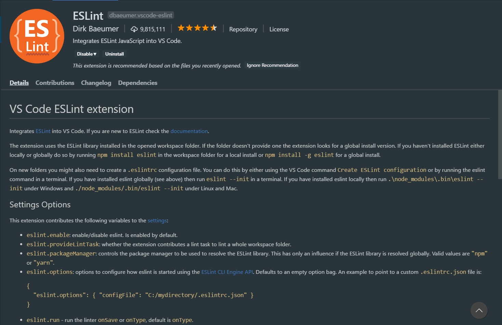

# eslint-airbnb-vscode
> Installing a nice light and useful Ecma Script Linting by combining **eslint**, **airbnb**, and **react** rules in vscode ide

## Getting Started
This tutorial will help you to install [ESLint](https://eslint.org/) linter with [airbnb](https://airbnb.com) and [react](https://reactjs.org/) recommendations for EcmaScript good coding.

### FIRST
You'll need to **install** some **modules** every time **in every project** you wanna use linting:

#### npm
```
npm install eslint eslint-config-eslint babel-eslint eslint-plugin-node eslint-plugin-import eslint-plugin-jsx-a11y eslint-plugin-react eslint-config-airbnb --dev
```
#### yarn
```
yarn add eslint eslint-config-eslint babel-eslint eslint-plugin-node eslint-plugin-import eslint-plugin-jsx-a11y eslint-plugin-react eslint-config-airbnb --dev
```

### SECOND
Install **ESLint** extension in **VsCode**



### THIRD
Add this **file** to the **root directory** of your **project**:  **[.eslintrc](./.eslintrc)**

### FOURTH
Set up a key **shortcut** for **eslint auto fix**

Select `File > Preferences > Keyboard Shorcuts` on the top bar.

A new tab will be opened.

Find and select **keybindings.json** in the top of current tab.

Another tab will be opened.

Add this code between the brackets:

```
{
    "key": "ctrl+shift+f",
    "command": "eslint.executeAutofix"
}
```
This will add <kbd>ctrl</kbd>+<kbd>shift</kbd>+<kbd>f</kbd> **shortcut** for eslint auto fixing.

You can customize it by changing the value of `"key": "ctrl+shift+f"`.


*Now, all is well for using recommendations. if there is a problem, tooltips will be shown to you what are the errors and warnings*

*Then, you can auto fix the problems by using the shortcut hot key you've already set*

*Note that: the `import/export syntax not found` won't be appeared with the configuration*


<hr />


### Authors
- ALireza Kavian

### License
This project is licensed under the MIT License - see the [LICENSE](./LICENSE) file for details
